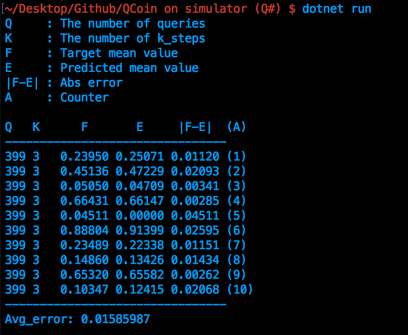

# QCoin-CGF-2020
This repository contains sample codes used in the paper: "Quantum Coin Method for Numerical Integration" (pulished in [Computer Graphics Forum]() (not yet), a manuscript is also available in [arXiv](https://arxiv.org/abs/1910.00263)).

## QCoin on simulator (Q#)
We reveal a sample code building a quantum circuit as Figure 6 (our paper). You can reproduce the QCoin's results of Figure 7 and Figure 8 by running the code many times with changing input variables appropriately.

### Install Q#
Please refer to [Install the Microsoft Quantum Development Kit](https://docs.microsoft.com/en-us/quantum/install-guide/?view=qsharp-preview).

### Run
Use ```dotnet run```  command on terminal.
The example of result:



You can specify values of the number of queries (```Total_Query```), k-steps (```k_max```), and trials (```aa_loop```) in the source code of  ```Driver.cs```. The program returns prediction value (```E```) for target value (```F```), and calculate absolute error (```|F-E|```).


## QSS on IBMQ (Qiskit)
We show a sample code reproducing a quantum circuit in Figure 9 (our paper) and estimating a given target mean value. For more details, please refer to Jupyter notebook ```QSS_on_IBMQ.ipynb```.


## QCoin on IBMQ (Qiskit)
We show a Qiskit code building a circuit of Figure 9 and forwarding calculational steps specified in Algorithm 1. You can see reduction of error along with increasing queries. For more information, please refer to Jupyter notebook.


## LICENSE
MIT License (see the [LICENSE](LICENSE) file for details).
